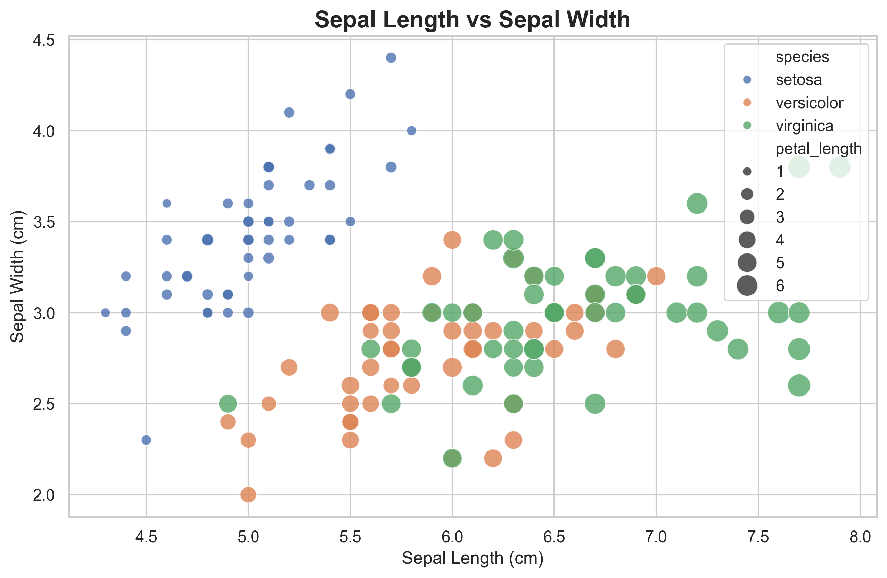
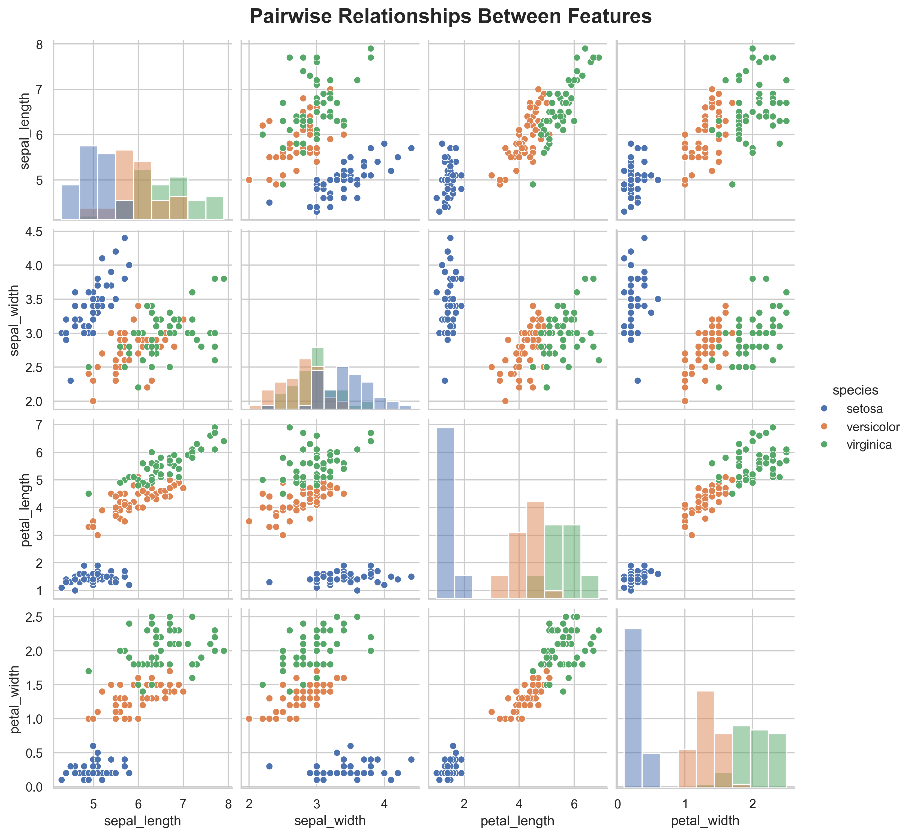
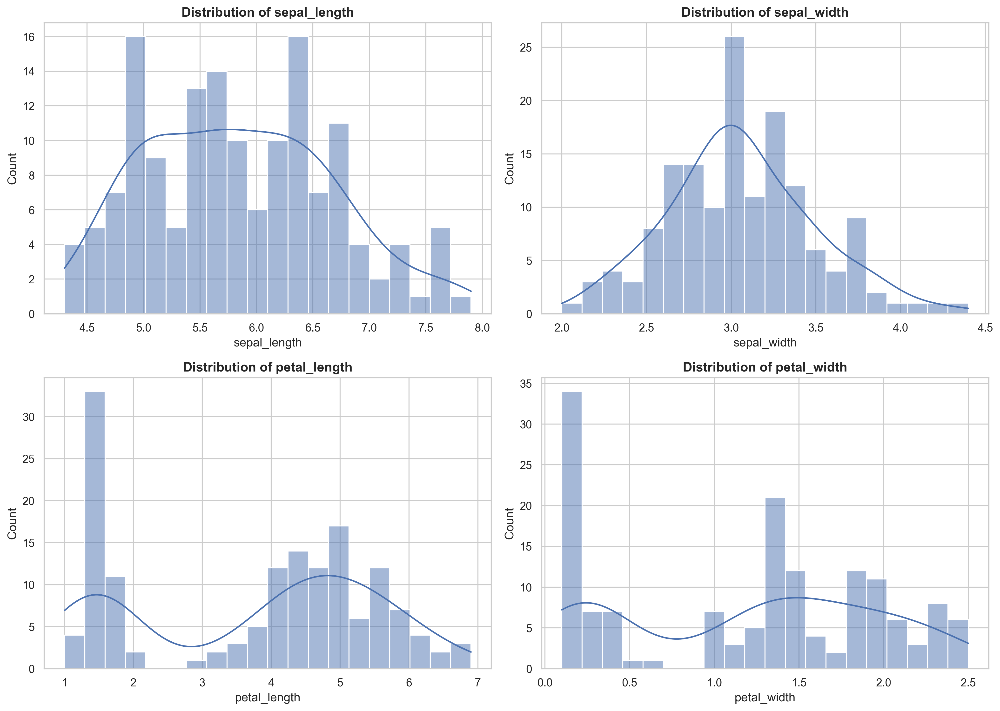
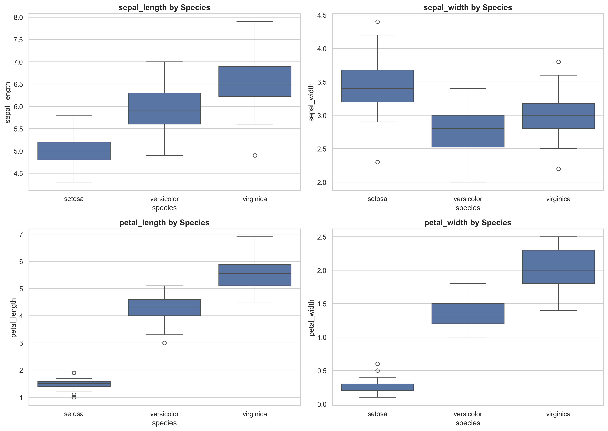
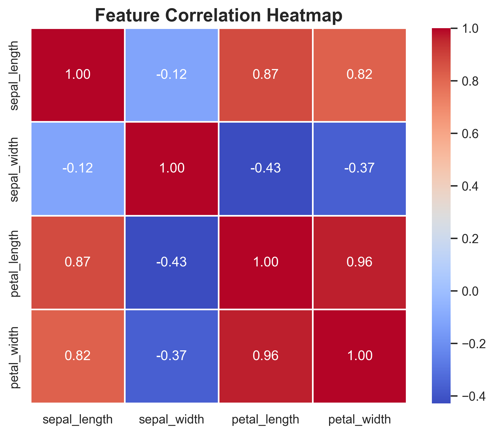

# Iris Dataset Exploratory Data Analysis (EDA)

<div align="center">


</div>

## Table of Contents

- [Project Overview](#project-overview)
- [Why EDA Matters](#why-eda-matters)
- [Project Objective](#project-objective)
- [About the Dataset](#about-the-dataset)
- [Dataset Information](#dataset-information)
- [Technologies Used](#technologies-used)
- [Python Libraries Used](#python-libraries-used)
- [Repository Structure](#repository-structure)
- [Installation](#installation)
- [How to Run the Project](#how-to-run-the-project)
- [EDA Workflow](#eda-workflow)
- [Visualization Details](#visualization-details)
- [Results & Insights](#results--insights)
- [Feature Correlation Analysis](#feature-correlation-analysis)
- [Outlier Analysis](#outlier-analysis)
- [Key Technical Highlights](#key-technical-highlights)
- [Future Improvements](#future-improvements)
- [Learning Outcomes](#learning-outcomes)
- [Conclusion](#conclusion)

---

## Project Overview

This project presents a structured exploratory data analysis of the classic Iris flower dataset using Python, Pandas, Seaborn, and Matplotlib. The objective is not merely to produce charts, but to examine data quality, feature behavior, class separability, statistical relationships, and modeling relevance in a disciplined AI/ML workflow.

From a portfolio perspective, this repository demonstrates how an ML candidate approaches dataset understanding before model development: validating structure, profiling features, investigating distributions, identifying outliers, measuring correlation, and producing reproducible visual artifacts for downstream analysis.

---

## Why EDA Matters

Exploratory Data Analysis is a foundational stage in machine learning and data science because model quality is heavily constrained by data quality and feature behavior. EDA helps answer practical questions early:

- Are the classes balanced?
- Are there missing values or duplicates?
- Which features appear most discriminative?
- Do any variables show strong correlation or redundancy?
- Are there outliers that could distort training behavior?

In real-world ML pipelines, EDA reduces avoidable modeling errors, improves feature selection decisions, and increases confidence in analytical findings before moving into training or deployment stages.

---

## Project Objective

The core objective of this project is to perform a clean, reproducible, and insight-driven EDA on the Iris dataset in order to:

- inspect dataset structure and quality,
- summarize statistical properties of numerical features,
- visualize inter-feature relationships and class separation,
- evaluate correlation patterns relevant to classification tasks,
- identify outlier behavior across species,
- generate interpretable analytical insights from the data.

---

## About the Dataset

The Iris dataset is a well-known multivariate dataset introduced by Ronald A. Fisher and frequently used in statistics, pattern recognition, and supervised learning research. It contains morphological measurements of iris flowers from three species:

- `setosa`
- `versicolor`
- `virginica`

Each observation records four quantitative botanical measurements:

- sepal length
- sepal width
- petal length
- petal width

Scientifically, the dataset is valuable because it captures measurable floral differences between species, making it a compact but meaningful benchmark for classification, feature analysis, and visualization.

---

## Dataset Information

| Attribute | Details |
|---|---|
| Dataset Name | Iris |
| Total Records | 150 |
| Total Features | 4 numerical features + 1 target label |
| Target Variable | `species` |
| Classes | 3 |
| Samples per Class | 50 each |
| Data Source | Loaded via `seaborn.load_dataset("iris")` |
| Data Quality | No missing values, balanced target classes |

---

## Technologies Used

| Category | Tools |
|---|---|
| Programming Language | Python |
| Data Analysis | Pandas |
| Visualization | Matplotlib, Seaborn |
| Workflow Style | Script-based EDA pipeline |
| Output Handling | Automated plot export to `eda_outputs/` |

---

## Python Libraries Used

| Library | Purpose |
|---|---|
| `pandas` | tabular data inspection, summary statistics, correlation analysis |
| `matplotlib` | figure creation, layout control, plot saving |
| `seaborn` | statistical visualization and dataset loading |
| `os` | output directory creation |
| `warnings` | clean console output during execution |

---

## Repository Structure

```text
Task1_Iris_Analysis/
│
├── eda_outputs/
│   ├── 1_scatter_plot.png
│   ├── 2_pairplot.png
│   ├── 3_histograms.png
│   ├── 4_boxplots.png
│   └── 5_heatmap.png
├── task1_iris_analysis.py
└── README.md
```

---

## Installation

Clone the repository and install the required Python packages:

```bash
git clone <your-repository-url>
cd Task1_Iris_Analysis
pip install pandas matplotlib seaborn
```

If you prefer a virtual environment:

```bash
python -m venv .venv
.venv\Scripts\activate
pip install pandas matplotlib seaborn
```

---

## How to Run the Project

Execute the analysis script from the project root:

```bash
python task1_iris_analysis.py
```

The script will:

- load the Iris dataset,
- perform structural and statistical inspection,
- generate visualizations,
- save all plots into `eda_outputs/`,
- print key analytical insights to the console.

---

## EDA Workflow

The analysis follows a clear, modular workflow:

1. **Dataset Loading**
   Load the Iris dataset using Seaborn with basic exception handling.
2. **Data Inspection**
   Validate shape, columns, data types, missing values, duplicates, and species distribution.
3. **Statistical Summary**
   Review descriptive statistics, median, variance, and inter-feature correlation.
4. **Visualization**
   Generate multiple plots to examine distributions, separability, and feature relationships.
5. **Insight Generation**
   Convert quantitative and visual observations into concise analytical findings.

---

## Visualization Details

### 1. Scatter Plot

Scatter plots are useful because they reveal pairwise relationships, clustering behavior, overlap between classes, and whether feature combinations can visually separate categories. In ML classification problems, this helps identify whether classes are linearly or non-linearly distinguishable.



### 2. Pairplot

Pairplots provide a compact multi-view comparison of all numerical features. They are particularly effective in early-stage feature analysis because they expose class separation, distribution shape, and repeated patterns across multiple feature combinations in one visual artifact.



### 3. Histograms

Histograms help assess how each feature is distributed, whether values are skewed, and whether variables appear concentrated, dispersed, or multi-modal. This is useful for understanding feature behavior before normalization, transformation, or model selection.



### 4. Boxplots

Boxplots matter because they summarize spread, median, variability, and potential outliers in a highly efficient form. For machine learning, outlier awareness is important because extreme values can influence distance-based methods, scaling behavior, and model stability.



### 5. Correlation Heatmap

Correlation analysis matters in machine learning because highly related features may carry overlapping information, which can affect interpretability, feature selection, and model efficiency. A heatmap makes these relationships immediately visible.



---

## Results & Insights

The EDA shows that the Iris dataset is exceptionally clean and well-structured, making it suitable for rapid experimentation in supervised learning. There are no missing values, class labels are perfectly balanced, and the numerical features display strong biological signal.

The most important analytical finding is that petal-based features provide stronger discriminatory power than sepal-based measurements. `setosa` forms a clearly separable cluster, while `versicolor` and `virginica` show partial overlap, especially in some sepal-based relationships. This observation is highly relevant for classification, as it suggests that petal measurements are more informative predictors for species identification.

The correlation structure further supports this: petal length and petal width exhibit a strong positive relationship, indicating that they move together and capture related morphological variation. At the same time, the dataset retains enough feature diversity to support meaningful visual and statistical interpretation.

Overall, the project demonstrates a clean example of how EDA can surface feature importance, class separability, and data reliability before model training begins.

---

## Feature Correlation Analysis

The correlation matrix highlights several useful ML-oriented observations:

- `petal_length` and `petal_width` are strongly positively correlated.
- sepal-based features are comparatively less predictive for clean class separation.
- petal dimensions are more structurally informative for species classification.

From a modeling perspective, correlation analysis is valuable because it helps:

- detect redundant variables,
- understand feature dependency,
- support feature engineering and feature selection decisions,
- improve interpretability before training a classifier.

---

## Outlier Analysis

Boxplot analysis indicates that `sepal_width` contains the most noticeable outlier behavior among the numerical features. This does not automatically imply bad data, but it is analytically important because outliers may:

- distort summary statistics,
- influence scaling-sensitive algorithms,
- affect distance-based classifiers or clustering methods,
- indicate subgroup variation worth investigating.

In this dataset, the outlier pattern appears manageable and does not compromise overall usability, but documenting it is part of a sound EDA process.

---

## Key Technical Highlights

- **Modular code structure:** the analysis is organized into focused functions for loading, inspection, statistical summary, visualization, and insight generation.
- **Exception handling:** dataset loading includes a guarded `try/except` flow for safer execution.
- **Automated visualization saving:** all charts are exported programmatically into `eda_outputs/` for reproducibility and portfolio presentation.
- **Clean EDA workflow:** the script follows a clear progression from inspection to interpretation.
- **Reusable functions:** visualization and analysis steps are separated into reusable units, improving maintainability and extensibility.

---

## Future Improvements

- add a `requirements.txt` file for environment reproducibility,
- convert the workflow into a Jupyter notebook for narrative analysis,
- integrate statistical tests and class-wise hypothesis exploration,
- add feature scaling and baseline classification models,
- package outputs into a lightweight reporting workflow.

---

## Learning Outcomes

This project reinforces several practical AI/ML engineering skills:

- performing structured dataset inspection,
- translating statistical summaries into analytical conclusions,
- using visualization to validate class behavior,
- identifying feature importance signals before model training,
- organizing EDA code into a maintainable and reusable script pipeline.

---

## Conclusion

This repository showcases a disciplined exploratory analysis of the Iris dataset with a clear emphasis on data quality, interpretability, and machine learning relevance. Rather than treating EDA as a formality, the project demonstrates how thoughtful analysis can guide feature understanding, reveal class structure, and improve downstream modeling decisions.

For an AI/ML internship portfolio, it reflects strong fundamentals in analytical thinking, visualization, and reproducible Python-based data workflows.
